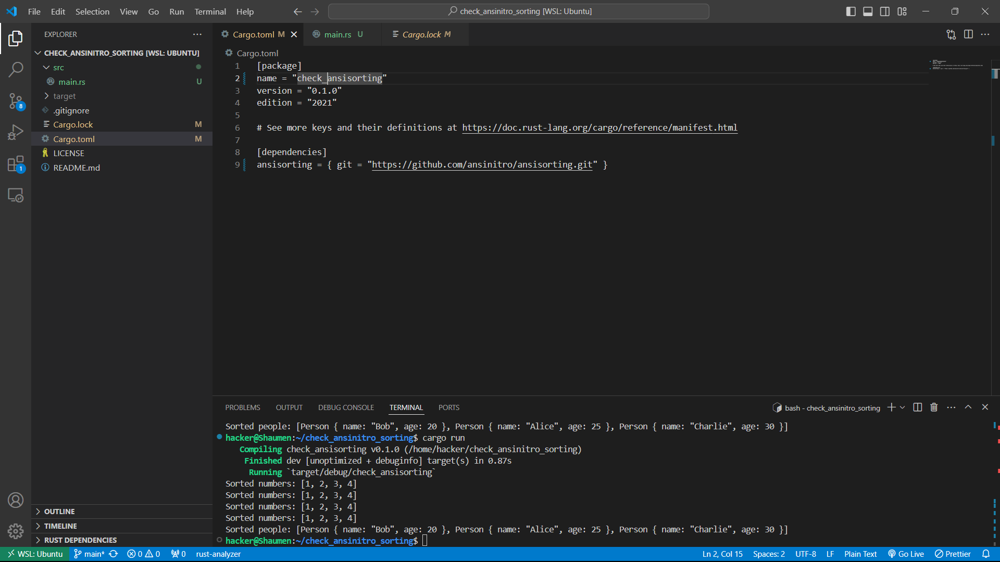
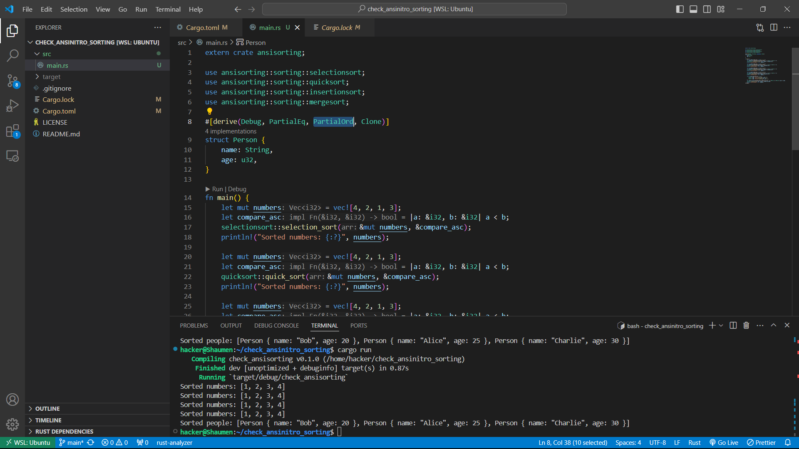

# Sorting Library

- This Rust library offers different sorting algorithms. It's flexible enough to sort any types that can be compared(`PartialOrd`) and copied(`Clone`, only for mergesort). The supported algorithms include Quick Sort, Selection Sort, Insertion Sort, and Merge Sort

## Getting started

### Presqurities :
 - Make sure you have Rust and Cargo installed on your computer. You can install them by following the instructions provided on the official Rust website: https://www.rust-lang.org/tools/install

### Installing (Usage) :

To utilize this library, include it as a dependency in your Rust project's `Cargo.toml` file:

```toml
[dependencies]
ansisorting = { git = "https://github.com/ansinitro/ansisorting.git" }
```

### Demo

Here's a demonstration my sorting library:





### Examples 
Sort i32:
```rust
extern crate ansisorting;

use ansisorting::sorting::{selectionsort, quicksort, insertionsort, mergesort};

fn main() {
    let mut numbers = vec![4, 2, 1, 3];
    let compare_asc = |a: &i32, b: &i32| a < b;
    selectionsort::selection_sort(&mut numbers, &compare_asc);
    println!("Sorted numbers: {:?}", numbers);
}
```

Sort Person struct:
```rust
extern crate ansisorting;

use ansisorting::sorting::{selectionsort, quicksort, insertionsort, mergesort};

#[derive(Debug, PartialEq, PartialOrd, Clone)]
struct Person {
    name: String,
    age: u32,
}

fn main() {
    let mut people = vec![
        Person { name: "Alice".to_string(), age: 25 },
        Person { name: "Bob".to_string(), age: 20 },
        Person { name: "Charlie".to_string(), age: 30 },
    ];
    let compare_by_age = |a: &Person, b: &Person| a.age < b.age;
    quicksort::quick_sort(&mut people, &compare_by_age);
    println!("Sorted people: {:?}", people);
}
```

### License 
- This project is licensed under the MIT License - see the LICENSE.md file for details.

### Authors 
- ansinitro - ansisorting - [ansinitro](https://github.com/ansinitro/)